# GitHub profile language statistics


Link:

``

Example:

``

## Available themes:

|            Name            | Preview                                         |
|:--------------------------:|-------------------------------------------------|
|            Main            |                        |
|            Dark            |                        |
|          Monokai           |                     |
|          Gradient          |                    |
|      Ambient Gradient      |            |
|     Vice City Gradient     |          |
|    Ocean Blue Gradient     |         |
| Eternal Constance Gradient |  |
|      Purpink Gradient      |            |


## Installation

1. Copy `example.env` file in `.env`

```shell
cp example.env .env
```
2. Setup docker containers

With make:

```make
make run
```

Without make:

```
docker-compose build && docker-compose up
```

> [!TIP]
> Full documentation available in the docs folder
