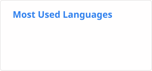
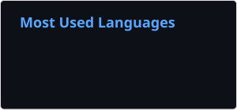
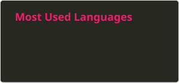
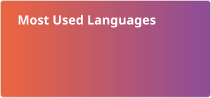
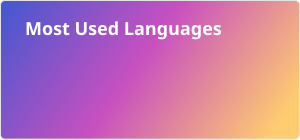
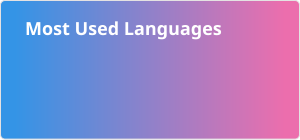
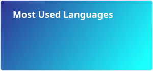
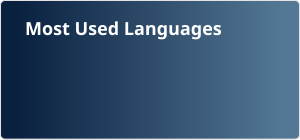
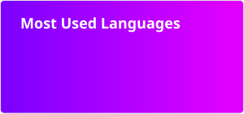

# 🚀 GitHub Profile Language Statistics


*Easily display a dynamic language usage chart on your GitHub profile!*

## 🌐 Get Your Badge

```md

```

### Example:
```md

```

## 🎨 Themes

Choose from a variety of stunning themes:

|            Name            | Preview                                         |
|:--------------------------:|-------------------------------------------------|
|            Main            |                        |
|            Dark            |                        |
|          Monokai           |                     |
|          Gradient          |                    |
|      Ambient Gradient      |            |
|     Vice City Gradient     |          |
|    Ocean Blue Gradient     |         |
| Eternal Constance Gradient |  |
|      Purpink Gradient      |            |

## 🛠️ Installation

Get started in just a few steps:

```sh
# 1. Copy environment configuration
cp example.env .env

# 2. Start the application with Docker
# Using Makefile:
make run

# Without Makefile:
docker-compose build && docker-compose up
```

## 📖 Documentation

For advanced setup, customization, and API details, check out the [docs](docs/) folder.

## ⭐ Star This Project!

If you find this useful, give it a **star** ⭐ and help others discover it! 🚀

