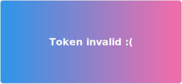

# Common error types and ways to fix them

| Error name                  | Appearance*                         | Way to fix                                                                                                                                    |
|-----------------------------|-------------------------------------|-----------------------------------------------------------------------------------------------------------------------------------------------|
| GitHub username not found   |       | Try to check your GitHub username. If your username is valid you can [open issue](https://github.com/byBenPuls/github-language-stats/issues). |
| Count of languages equals 0 |  | Probably you don't have a (public) repositories yet.                                                                                          |
| Invalid token               |  | Necessary to reissue GitHub token                                                                                                             |

*Card theme doesn't matter